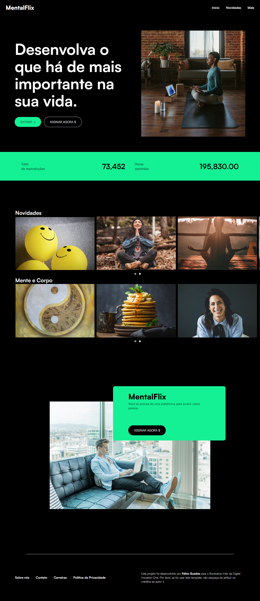

# Sobre

Projeto realizado para o bootcamp 'Inter Frontend Developer' onde a ideia era criar uma cópia da página da Netflix

Após concluido o projeto, tomei a liberdade de repaginá-lo por completo, trocando cores, imagens e o resto do design, mantendo apenas o conceito de 'exibição streaming'

O resultado final foi uma plataforma de assinatura que transmite aulas de meditação, yoga, receitas saudáveis, etc.

Obs.: ainda estou trabalhando para deixá-lo 100% responsivo

## Linguagens

- HTML
- CSS
- JavaScript

## Preview

    

